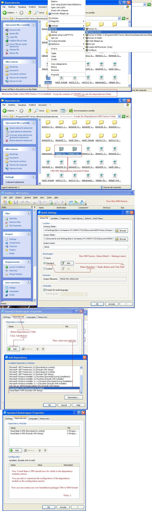

<div align="center">

## Use the Visual Basic 6 SP6 dependency module with MSI Factory 2\.0 to detect and install Visual Basic


</div>

### Description

Use the Visual Basic 6 SP6 dependency module with MSI Factory 2.0 Software installation to generate file installation MSI for Visual Basic 6 SP6.
 
### More Info
 


<span>             |<span>
---                |---
**Submitted On**   |2009-04-11 08:20:02
**By**             |[Salvo Cortesiano \(Italy\)](https://github.com/Planet-Source-Code/PSCIndex/blob/master/ByAuthor/salvo-cortesiano-italy.md)
**Level**          |Intermediate
**User Rating**    |5.0 (15 globes from 3 users)
**Compatibility**  |VB 6\.0
**Category**       |[Miscellaneous](https://github.com/Planet-Source-Code/PSCIndex/blob/master/ByCategory/miscellaneous__1-1.md)
**World**          |[Visual Basic](https://github.com/Planet-Source-Code/PSCIndex/blob/master/ByWorld/visual-basic.md)
**Archive File**   |[Use\_the\_Vi2149454112009\.zip](https://github.com/Planet-Source-Code/salvo-cortesiano-italy-use-the-visual-basic-6-sp6-dependency-module-with-msi-factory-2-0-t__1-71976/archive/master.zip)


### Source Code

```
Use the Visual Basic 6 SP6 dependency module with MSI Factory 2.0 to detect and install Visual Basic 6 SP6.
Background Information:
Download and Install (MSI Factory v2.1.1005.0.msi) at this Link: http://www.netshadows.it/MSIFactory.rar
Installs Service Pack 6 for Visual Basic 6.0 provides the latest updates to Visual Basic 6.0. It is recommended
for all users of Visual Basic 6.0. Applications and controls written in Visual Basic 6 require the VB6 SP6 Redistributable Package
to be installed on the computer where the application or control runs. The Visual Basic 6 SP6 installation package is available
as a stand-alone executable file, VB6.0-KB290887-X86.exe. When this dependency module is included in your setup, it installs
Visual Basic 6 SP6 if needed.
Installation Instructions
To make Visual Basic 6 SP6 dependency module available in your MSI Factory 2.0 projects, follow the steps below:
1. Close MSI Factory 2.0, if it is running.
2. Browse to the folder where MSI Factory 2.0 is installed on your system. By default it is C:\Program Files\MSI Factory
(on Windows Vista (64-bit) it is C:\Program Files (x86)\MSI Factory).
3. Open the folder called Dependencies.
4. Unzip the contents of VB6SP6.zip (see bottom of article) into the dependencies folder.
5. Download the Visual Basic 6 SP6 setup file (VB6.0-KB290887-X86.exe) into the vb6sp6_Include subfolder.
6. Restart MSI Factory 2.0.
To use your new dependency module, select Build > Settings from the main menu. Select standard bootstrapper option and click the Edit button.
Click dependencies tab and click Add button. Select Visual Basic 6 SP6 dependency module from the list of available dependency modules.
Visual Basic 6 SP6 should now be visible in the dependency modules section. You can edit or customize the configuration of the dependency
module in the configuration section.
```

